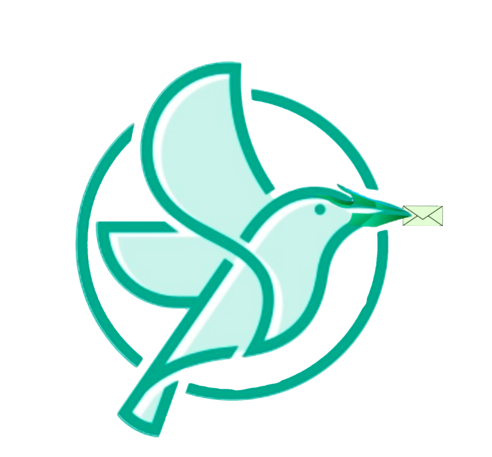

<div align="center">
  
  <h1>🧠 Sandesai — AI Messenger</h1>
  <p><em>Production‑grade communication, reimagined for the AI era</em></p>
  <p><strong>Live Demo:</strong> <a href="https://suryasticsai.github.io/sandesai">suryasticsai.github.io/sandesai</a></p>
</div>
 

> *Production‑grade communication, reimagined for the AI era*

**Live Demo:** [suryasticsai.github.io/sandesai](https://suryasticsai.github.io/sandesai)

---

<div align="center">


</div>

---

## ✨ The Vision

Sandesai is not just another messaging app. It's a **unified communication platform** that seamlessly blends **real‑time chat, voice/video calling, AI assistance, and WebRTC‑powered peer‑to‑peer connectivity** — all wrapped in a sleek, neon‑inspired interface.

Built with modern web technologies and designed for **beta production**, Sandesai is ready to power everything from personal communication to enterprise‑grade customer engagement.

---

## 🚀 Key Features

| Feature | Description |
|---------|-------------|
| **💬 Real‑time Chat** | Firestore‑backed instant messaging with typing indicators, presence detection, and message history. |
| **📞 WebRTC Calling** | Peer‑to‑peer voice and video calls with mute, speaker, and video toggle — no central server required. |
| **🤖 AI Voice Assistant (RAGina)** | Conversational AI that listens, speaks, and assists — powered by a RAG pipeline. |
| **📇 Smart Contacts** | Save numbers directly from call logs or the dialer. Contacts sync across devices via Firebase. |
| **🔐 One‑tap Registration** | OTP‑based number verification with persistent local storage — register once, use everywhere. |
| **🎨 Adaptive Themes** | Light, Dark, and Neon modes that adapt to your mood and environment. |
| **📊 Call Analytics** | Detailed call history with transcripts, AI‑generated summaries, and export to TXT/JSON. |
| **📱 Mobile‑First** | Responsive design that works flawlessly on phones, tablets, and desktops. |

---

## 🎯 Unique Selling Propositions (USPs)

### 1. **Decentralised Calling**
Unlike traditional messaging apps that rely on centralised servers, Sandesai uses **PeerJS** for direct peer‑to‑peer WebRTC connections. This means:
- **Lower latency** — calls are routed directly between peers.
- **No server costs** — your infrastructure stays lightweight.
- **Better privacy** — media streams never touch a third‑party server.

### 2. **AI‑Native by Design**
RAGina isn't just a chatbot — it's a **voice‑first AI assistant** that:
- Listens to your voice and responds naturally.
- Learns from your conversations.
- Integrates with the call flow to provide real‑time assistance.
- Can be extended to handle customer support, lead qualification, or even internal knowledge retrieval.

### 3. **Unified Communication Hub**
Sandesai brings together **chat, calls, and AI** in a single interface. No more switching between apps — everything you need is in one place.

### 4. **Production‑Grade Foundation**
Built with:
- **Firebase Firestore** for real‑time data sync.
- **PeerJS** for robust WebRTC signalling.
- **Service Workers** for offline support.
- **LocalStorage** for persistent user data.
- **PWA‑ready** — install it on your phone like a native app.

---

## 🏢 Business Use Cases

| Industry | Application |
|----------|-------------|
| **Customer Support** | Deploy RAGina as a 24/7 AI agent that handles common queries, escalates to human agents, and logs interactions. |
| **Sales & Lead Generation** | Use the calling feature for outbound sales calls, with AI‑powered call summarisation and lead scoring. |
| **Telehealth** | Secure voice/video consultations with automatic transcription and AI‑generated patient summaries. |
| **Education** | Virtual classrooms with real‑time chat, voice Q&A, and AI‑powered tutoring. |
| **Remote Teams** | Internal communication with chat, voice, and video — all self‑hosted and privacy‑focused. |
| **Event Management** | Broadcast announcements, manage RSVPs, and conduct live polls via the chat interface. |

---

## 🧰 Tech Stack

```

┌─────────────────────────────────────────────────────────┐
│  Frontend          : HTML5, CSS3, Vanilla JS           │
│  Real‑time DB      : Firebase Firestore                │
│  WebRTC            : PeerJS                            │
│  AI Pipeline       : RAGina (custom RAG agent)         │
│  Voice Recognition : Web Speech API                    │
│  Text‑to‑Speech    : Web Speech Synthesis              │
│  Hosting           : GitHub Pages                      │
│  PWA               : Service Worker + Manifest         │
└─────────────────────────────────────────────────────────┘

```

---

## 👨‍💻 About the Creator

**Surya (suryasticsai)** is a **Techno Agilist, Dev Engineer, and Strategic Consultant** with over **6+ years of experience** at **Tata Consultancy Services**.

He specialises in:
- Building **scalable web applications** with modern JavaScript.
- Integrating **AI/ML pipelines** into production systems.
- Designing **user‑centric interfaces** that blend form and function.
- Leading **cross‑functional teams** to deliver high‑impact solutions.

---

## 🔗 Connect with Surya

<div align="center">

[](mailto:suryasticsai@gmail.com)
[](https://github.com/suryasticsai)
[](https://huggingface.co/suryasticsai)
[](https://medium.com/@suryasticsai)
[](https://instagram.com/suryasticsai)
[](https://linkedin.com/in/suryasticsai)

</div>

---

## 🚦 Getting Started

### Prerequisites
- A modern browser (Chrome, Firefox, Edge, or Safari).
- Internet connection for Firebase and WebRTC signalling.

### Installation
1. Clone the repository:
   ```html
   git clone https://github.com/suryasticsai/sandesai.git

2. Open index.html in your browser.
3. Register with a 10‑digit phone number (OTP: 1234).
4. Start chatting, calling, and exploring!
```
---
Deployment

The app is deployed via GitHub Pages at suryasticsai.github.io/sandesai. To deploy your own instance:

1. Fork the repository.
2. Enable GitHub Pages in the repository settings.
3. Push changes to the main branch.

---

🧪 Beta Status

Sandesai is currently in Beta (v0.1). We're actively developing new features and refining the existing ones.

Known Limitations

· WebRTC calling requires both peers to be online simultaneously.
· RAGina's knowledge base is limited to the pre‑loaded context.
· OTP verification is demo‑only (use 1234).

Roadmap

☐ End‑to‑end encryption for chats.
☐ Group calling and messaging.
☐ Custom AI agent training.
☐ Native mobile apps (React Native).
☐ Admin dashboard for enterprise users.

---

🤝 Contributing

Contributions are welcome! Please open an issue or submit a pull request.

1. Fork the repository.
2. Create a feature branch (git checkout -b feature/amazing-feature).
3. Commit your changes (git commit -m 'Add amazing feature').
4. Push to the branch (git push origin feature/amazing-feature).
5. Open a Pull Request.

---

📄 License

This project is licensed under the MIT License — see the LICENSE file for details.

---

🙏 Acknowledgements

· PeerJS for making WebRTC simple.
· Firebase for real‑time data sync.
· Font Awesome for beautiful icons.
· Google Fonts for the Inter and Space Grotesk typefaces.
· The open‑source community for endless inspiration.

---

📬 Feedback

Have a suggestion or found a bug? Open an issue or reach out to Surya directly via GitHub.

---

<div align="center">

Sandesai — Where AI meets communication.

Built with ♥ by Surya

⬆ Back to top

</div>
```
